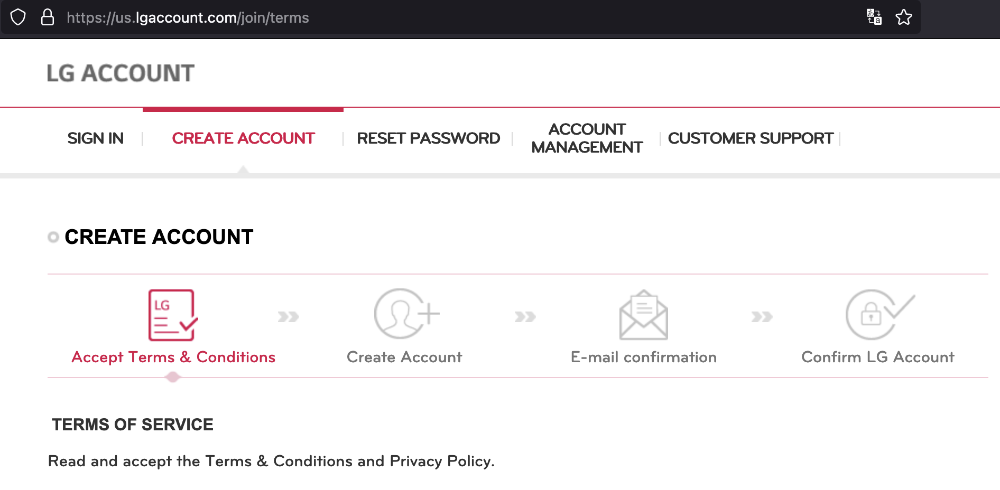
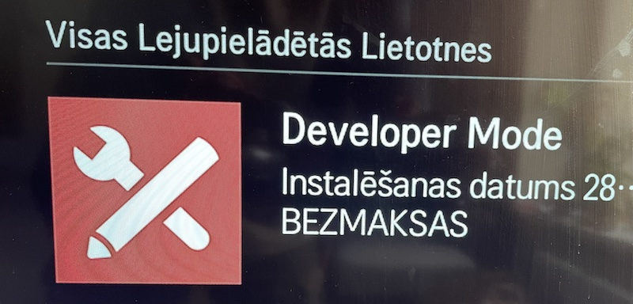
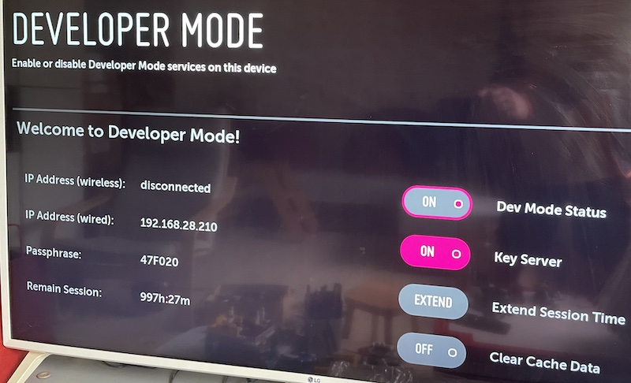
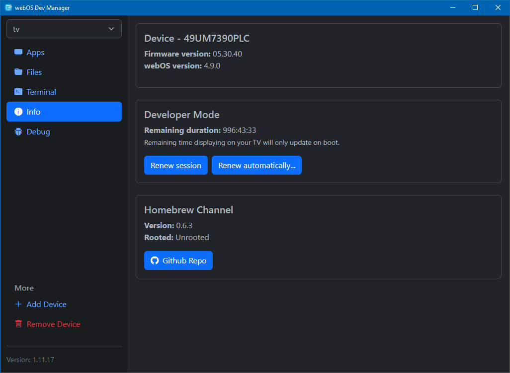

# Kā skatīties YouTube bez reklāmām uz LG tv ar WebOS

Pirms es šo izveicu, aplūkoju visādus variantus. Lielākā daļa stipri apšaubāmi un pat bīstami. Rūtošana ar vietnes *rootmy.tv* palīdzību un tamlīdzīgi. Pi Hole'i vajag papildus dzelžus un prasmes, a man slinkums.

## TL;DR
Vajag uzinstalēt **YouTube AdFree** aplikāciju televizorā. Tam vajag Hombrew Channel, ko aktivē WebOS Dev Manager'ī, kam vajag Developer Mode, ko var dabūt tikai, ja ir LG Developer konts.

## Soļi:
1. Ir jāpiereģistrējas kā LG izstrādātājam. Jādodas uz vietni https://us.lgaccount.com/join/terms, kur var to izdarīt. Jānorāda īsts e-pasts, lai apstiprinātu konta reģistrēšanu.
   
   
2. Tagad televizorā var uzstādīt Developer mode aplikāciju (tur būs TV restarts, ja kas)
   
3. Jāpalaiž aplikācija Developer Mode. Te būs jāierakstās ar savu LG kontu. Pēc Dev mode aktivizēšanas, tiks restartēts televizors.
   
   
***NB!*** Te ir svarīgi 2 parametri: **IP adrese** un **Passphrase**. Tos jānoraksta uz papīrīša!

4. Tagad ir jāpieslēdzas televizoram no ārpuses. Būs nepieciešama aplikācija Device/DevMode Manager for webOS TV. Pieejama Linux, MacOS un Windows (sranais Elecron's). Saite: https://github.com/webosbrew/dev-manager-desktop/. Download sadaļā Jāspiež uz Latest release un jālejupielādē.
   
5. Abām ierīcēm (TV un datoram) jābūt vienā tīklā! Tad var pievienot ierīci, veicot vajadzīgās informācijas ievadi. Visu šo darbību mērķis ir Hombrew (sveiciens āboļa lietotājiem) Channel pieskrūvēšana televizoram. Šis kanāls satur alternatīvas aplikācijas.
    
   
6. Beigās no Hombrew Channel rodas iespēja uzinstalēt aplikāciju YouTube AdFree, kas arī bija visu šo darbību mērķis :) To var izdarīt gan no datora, gan televizorā.
   
   
7. Baudam YT bez reklāmām!
